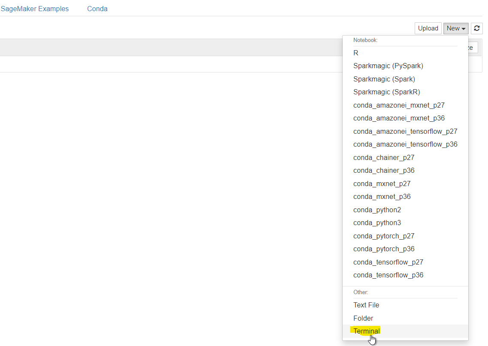

# Creating a Notebook Instance

We'll start by creating an Amazon S3 bucket that will be used throughout the workshop.  We'll then create a SageMaker notebook instance, which we will use for the other workshop modules.

## 1. Launching the Notebook Instance

1. Make sure you are on the AWS Management Console home page.  In the **Find Services** search box, type **SageMaker**.  The search result list will populate with Amazon SageMaker, which you should now click.  This will bring you to the Amazon SageMaker console homepage.


2. In the upper-right corner of the AWS Management Console, confirm you are in the desired AWS region. Select N. Virginia, Oregon, Ohio, or Ireland.

3. To create a new notebook instance, click the **Notebook instances** link on the left side, and click the **Create notebook instance** button in the upper right corner of the browser window.


4. Type smworkshop-[First Name]-[Last Name] into the **Notebook instance name** text box, and select ml.m5.xlarge for the **Notebook instance type**.


1. In the **Permissions and encryption** section, choose **Create a new role** in the **IAM role** drop down menu.  In the resulting pop-up modal, select **Any S3 Bucket** under **S3 Buckets you specify – optional**. Click **Create role**.


6. You will be taken back to the Create Notebook instance page.  Now you should see a message saying "Success! You created an IAM role."


7. Click **Create notebook instance** at the bottom.

### 3. Accessing the Notebook Instance

1. Wait for the server status to change to **InService**. This will take several minutes, possibly up to ten but likely much less.


2. Click **Open Jupyter**. You will now see the Jupyter homepage for your notebook instance.


### 4. Clone the workshop repository to your notebook

1. In the Jupyter notebook page, click on **New** and then click **Terminal**



2. In the command prompt window, paste the following command and press enter:

```cd SageMaker/```

3. Paste the next command and press enter:

```git clone https://github.com/awslabs/amazon-sagemaker-workshop.git```

### 5. Begin Lab 1: 

1. Back on the Jupyter notebook home page, click on **SageMaker Examples** tab, and underneath **Introduction to Amazon Algorithms**, look for **blazingtext_text_classification_dbpedia.ipynb**

2. Click on **Use** and then click on **Create copy**

3. You will then be sent to the notebook itself. Read each cell carefully and execute the cells in sequence to complete the lab.
4. Ask your friendly SA's for help!